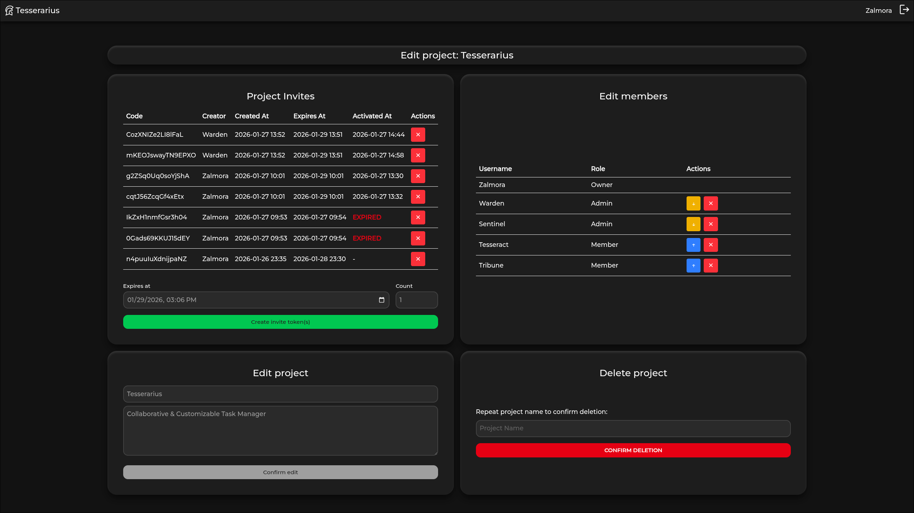
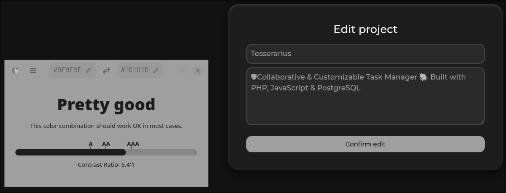
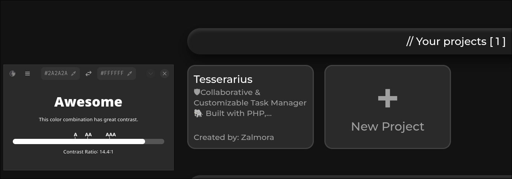
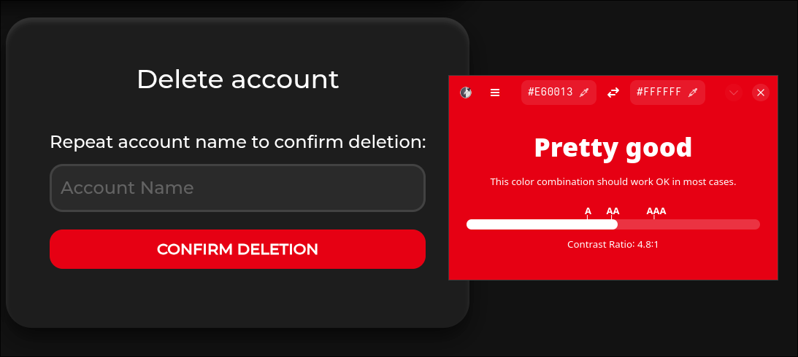
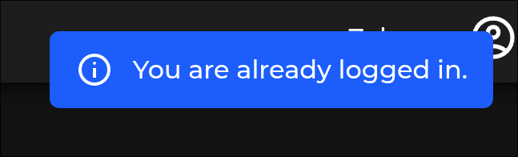

<h1>
   
   Tesserarius
</h1>




<br>
🛡 Collaborative & Customizable Task Manager 🐘 Built with PHP, JavaScript & PostgreSQL ✨ Inspired by Trello & Notion, allowing users to create and join projects with custom task metadata tags.

## Prerequisites & Running

### Running
1. Install **Docker CLI** & **Docker Compose** on your system.
2. Clone the repository.
3. Navigate to the project directory.
4. Start the project:
   ```bash
   docker-compose up -d
   
### Building and Running
1. Install **Docker CLI** & **Docker Compose** on your system.
2. Clone the repository.
3. Navigate to the project directory.
4. Run npm to build assets:
   ```bash
   npm install
   npm run build
   ```
5. Run composer to install PHP dependencies:
   ```bash
   composer install
   ```
6. Start the project:
   ```bash
   docker-compose up -d

## Usage

- Website: http://localhost/, first signup a user.
- pgAdmin: http://localhost:8080, use credentials found in `compose.yml -> pgadmin`:
    - Site login:
      - **Email Address:** admin@local.dev
      - **Password:** admin123
    - Server connection:
      -  **Password:** database123

## Stop / Cleanup
* Stop containers:
   ```bash
   docker-compose stop
* Remove containers and named volume _(tesserarius_postgres_data)_:
    ```bash
   docker-compose down -v
  
## Development

### Security

- **Router Authentication**: All routes protected via `Router::handleRequest()` checking session auth status
- **Router Authorization**: All routes verify a user's `UserRole` against the routes `AccessRole` before allowing access
- **SQL Injection Prevention**: All database queries use a base PDO statement
- **XSS & CSP**: Randomly generated CSP nonces for all JS scripts, with CSP setup to be as strict as possible
- **CSRF Protection**: Randomly generated CSRF token validation for all POST requests via `Csrf` class
- **Input Validation & Sanitation**: Server-side validation of all user input & HTML sanitization via `Escaper` class
- **Password Security**: Passwords hashed with bcrypt (`password_hash()`)
- **Data Minimization**: DTOs (`UserAuthDto`, `UserIdentityDto`, etc.) limit data exposure
- **Error Handling**: Sensitive errors logged only on server-side, whilst users receive easy to understand messages

### MVC & Architecture

- **Service & Repository Layers**: Business logic in services (`AuthService`...), data access in repositories (`AuthRepository`...)
- **Interface-Based Integration**: All layers use interfaces (`*ServiceInterface`, `*RepositoryInterface`)
- **Dependency Injection**: Constructors Dependency Injection for all backend layers (controllers, services, repositories)
- **Routing**: Route definitions in `Routes.php` with controller method binding via `Router` class (see Dependencies)
- **View Templating**: `View::render()` provides automatic view mapping and data passing to templates
- **DRY Principles**: Shared helpers eliminate code duplication:
  - `ServiceException::handleRepoCall()` - Repository error handling across all services
  - `View::render()` - View rendering with automatic data extraction
  - `BaseApiController` - Common API response formatting
  - `Routes::route()` - Additional fields for route authentication/authorization
- **OOP Concepts**: 
  - Inheritance (exception hierarchy, base classes)
  - Encapsulation (private/protected properties, DTOs)
  - Polymorphism (interface implementations, enums)
- **final & readonly**: As many classes marked as `final` and/or `readonly` for immutability and clarity

### API & JS

- **JSON API Endpoints**: `TaskApiController` provides REST API for task operations through AJAX (create, edit, delete) with JSON responses
- **Authentication & Authorization**: All API requests verify project membership via `BaseApiController::authenticateRequest()` before allowing operations
- **Request Authorization**: Checks preventing users from editing/deleting tasks if they've been removed from the project after page load
- **Error Responses**: JSON error messages with appropriate HTTP status codes (403, 400, 500)

### Legal & Accessibility

**WCAG 2.1 Compliance (Level AA):**
- **Color Contrast**: Text colors meet minimum 4.5:1 contrast ratio (See list below)
- **Keyboard Navigation**: All interactive elements (forms, buttons, modals) accessible via keyboard
- **Focus Indicators**: Visible focus states on all interactive elements (Tailwind `focus:`)
- **Error Identification**: Clear error messages via toast notifications (`$_SESSION['flash_errors']`) describing what went wrong
- **Responsive Design**: Tablet- and Mobile-friendly layout adapting to different screen sizes

<details>
<summary><b>WCAG Color Contrast Examples</b></summary>






</details>

**GDPR Compliance:**
- **Right of Access**: Users can view their account data (username, email) on the [settings page](/app/Views/Pages/User/settings.php)
- **Right to Rectification**: Users can [edit](/app/Services/UserService.php) and correct their username and email
- **Right to Erasure**: Users can [delete](/app/Services/UserService.php) their account with name confirmation
- **Data Security**: Passwords hashed with bcrypt, secure session management,[CSRF](/app/Core/Csrf.php) & [CSP](/app/Core/Csp.php) protection
- **Data Minimization**: Only essential data collected (username, email, password hash) - no tracking or third-party data sharing
